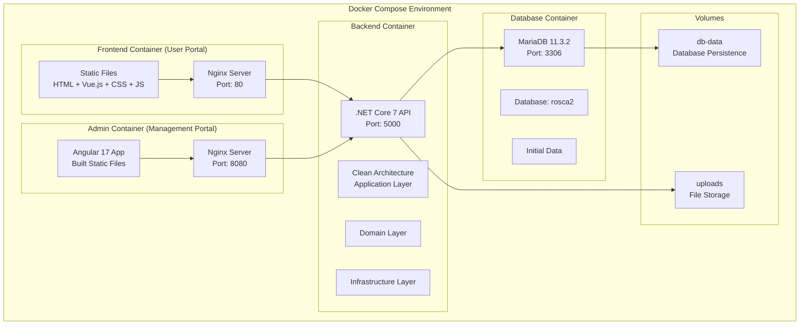

# 設計文件

## 概述

本設計文件描述了如何為現有的全端應用程式建立本地 Docker 部署環境。該應用程式採用四層架構：
- 前台：HTML + Vue.js 靜態網站（使用者介面）
- 後台：Angular 17 管理系統（管理員介面）
- 後端 API：.NET Core 7 Clean Architecture API
- 資料庫：MariaDB 11.3.2

目標是創建一個完整的 Docker Compose 配置，讓開發者能夠使用單一命令啟動整個應用程式堆疊，包含前台使用者系統和後台管理系統。

## 架構

### 整體架構圖



### 網路架構

- 所有容器將在同一個 Docker 網路中運行
- 前台透過 Nginx 反向代理訪問後端 API（端口 80）
- 後台管理系統透過 Nginx 反向代理訪問後端 API（端口 8080）
- 後端直接連接到 MariaDB 資料庫
- 外部訪問透過兩個端口：
  - 80：前台使用者系統
  - 8080：後台管理系統

## 組件和介面

### 1. 前台容器 (Frontend - User Portal)

**技術棧：**
- Base Image: nginx:alpine
- 靜態檔案：HTML, CSS, JavaScript, Vue.js

**配置：**
- 端口映射：80:80
- 靜態檔案掛載：./frontend -> /usr/share/nginx/html
- Nginx 配置：支援靜態檔案服務和 API 代理

**Nginx 配置重點：**
```nginx
server {
    listen 80;
    server_name localhost;
    root /usr/share/nginx/html;
    index index.html;
    
    # 靜態檔案
    location / {
        try_files $uri $uri/ /index.html;
    }
    
    # API 代理
    location /api/ {
        proxy_pass http://backend:5000/api/;
        proxy_set_header Host $host;
        proxy_set_header X-Real-IP $remote_addr;
        proxy_set_header X-Forwarded-For $proxy_add_x_forwarded_for;
        proxy_set_header X-Forwarded-Proto $scheme;
    }
}
```

### 2. 後台管理容器 (Admin - Management Portal)

**技術棧：**
- Base Image: node:18-alpine (build stage)
- Runtime Image: nginx:alpine
- Framework: Angular 17

**配置：**
- 端口映射：8080:80
- 建置流程：多階段 Docker 建置
- Nginx 配置：支援 SPA 路由和 API 代理

**Dockerfile 結構：**
```dockerfile
# Build stage
FROM node:18-alpine AS build
WORKDIR /app
COPY backend/FontEnd/FontEnd/package*.json ./
RUN npm ci
COPY backend/FontEnd/FontEnd/ .
RUN npm run build

# Runtime stage
FROM nginx:alpine
COPY --from=build /app/dist/font-end /usr/share/nginx/html
COPY admin-nginx.conf /etc/nginx/conf.d/default.conf
EXPOSE 80
```

**Admin Nginx 配置：**
```nginx
server {
    listen 80;
    server_name localhost;
    root /usr/share/nginx/html;
    index index.html;
    
    # Angular SPA 路由
    location / {
        try_files $uri $uri/ /index.html;
    }
    
    # API 代理
    location /api/ {
        proxy_pass http://backend:5000/api/;
        proxy_set_header Host $host;
        proxy_set_header X-Real-IP $remote_addr;
        proxy_set_header X-Forwarded-For $proxy_add_x_forwarded_for;
        proxy_set_header X-Forwarded-Proto $scheme;
    }
}
```

### 3. 後端容器 (Backend API)

**技術棧：**
- Base Image: mcr.microsoft.com/dotnet/aspnet:7.0
- Build Image: mcr.microsoft.com/dotnet/sdk:7.0
- Framework: .NET Core 7.0

**配置：**
- 內部端口：5000
- 環境變數：
  - ASPNETCORE_ENVIRONMENT=Development
  - ConnectionStrings__BackEndDatabase=Server=mariadb;Port=3306;User Id=root;Password=rootpassword;Database=rosca2;
- 檔案掛載：上傳檔案持久化

**Dockerfile 結構：**
```dockerfile
# Build stage
FROM mcr.microsoft.com/dotnet/sdk:7.0 AS build
WORKDIR /src
COPY . .
RUN dotnet restore
RUN dotnet publish -c Release -o /app/publish

# Runtime stage
FROM mcr.microsoft.com/dotnet/aspnet:7.0
WORKDIR /app
COPY --from=build /app/publish .
EXPOSE 5000
ENTRYPOINT ["dotnet", "DotNetBackEndApi.dll"]
```

### 4. 資料庫容器 (Database)

**技術棧：**
- Base Image: mariadb:11.3.2
- 資料庫：rosca2

**配置：**
- 內部端口：3306
- 環境變數：
  - MYSQL_ROOT_PASSWORD=rootpassword
  - MYSQL_DATABASE=rosca2
  - MYSQL_USER=appuser
  - MYSQL_PASSWORD=apppassword
- 資料持久化：db-data volume
- 初始化腳本：自動執行 SQL 腳本

**初始化腳本結構：**
1. 建立資料庫結構（從 SqlScript.txt）
2. 載入預設資料（從 default data 資料夾）
3. 建立預設使用者帳號

## 資料模型

### 資料庫初始化

**主要表格：**
- member_master：使用者主檔
- member_wallet：使用者錢包
- announcement_board：公告板
- tender_master：標案主檔
- tender_detail：標案詳細
- 其他業務相關表格

**預設使用者資料：**
```sql
INSERT INTO member_master (
    mm_id, mm_account, mm_hash_pwd, mm_2nd_hash_pwd, mm_name,
    mm_introduce_code, mm_invite_code, mm_level, mm_role_type,
    mm_status, mm_kyc, mm_create_member, mm_create_datetime,
    mm_update_member, mm_update_datetime
) VALUES (
    1, '0938766349', 
    -- BCrypt hash for '123456'
    '$2a$12$LQv3c1yqBWVHxkd0LHAkCOYz6TtxMQJqhN8/LewdBdXwtGtrKm9K2',
    '$2a$12$LQv3c1yqBWVHxkd0LHAkCOYz6TtxMQJqhN8/LewdBdXwtGtrKm9K2',
    '測試使用者', 0, 0, '1', '1', 'Y', 'Y',
    1, NOW(), 1, NOW()
);
```

### 檔案儲存

**上傳檔案類型：**
- KYC 認證圖片：KycImages/
- 存款證明圖片：DepositImages/
- 提款證明圖片：WithdrawImages/
- 公告圖片：AnnImagessss/

## 錯誤處理

### 容器啟動順序

使用 `depends_on` 和健康檢查確保正確的啟動順序：
1. MariaDB 容器先啟動並完成初始化
2. 後端容器等待資料庫就緒後啟動
3. 前端容器最後啟動

### 健康檢查

**資料庫健康檢查：**
```yaml
healthcheck:
  test: ["CMD", "mysqladmin", "ping", "-h", "localhost"]
  timeout: 20s
  retries: 10
```

**後端健康檢查：**
```yaml
healthcheck:
  test: ["CMD", "curl", "-f", "http://localhost:5000/health"]
  timeout: 10s
  retries: 5
```

### 錯誤恢復

- 資料庫連接失敗：後端自動重試連接
- 容器崩潰：Docker Compose 自動重啟
- 資料持久化：使用 Docker volumes 確保資料不丟失

## 測試策略

### 整合測試

1. **容器啟動測試：**
   - 驗證所有容器成功啟動
   - 檢查容器間網路連通性
   - 確認端口映射正確

2. **資料庫初始化測試：**
   - 驗證資料庫結構正確建立
   - 確認預設資料載入成功
   - 測試預設使用者帳號登入

3. **API 連通性測試：**
   - 前台到後端 API 連接
   - 後台管理系統到後端 API 連接
   - 後端到資料庫連接
   - CORS 設定驗證

4. **功能測試：**
   - 前台使用者登入功能
   - 後台管理員登入功能
   - 基本 CRUD 操作
   - 檔案上傳功能

### 效能測試

- 容器啟動時間監控
- API 回應時間測試
- 資料庫查詢效能驗證

## 安全考量

### 網路安全

- 僅暴露必要的端口（80 前台，8080 後台）
- 使用內部 Docker 網路進行容器間通信
- 資料庫不直接暴露到外部

### 資料安全

- 使用環境變數管理敏感資訊
- 資料庫密碼加密儲存
- 檔案上傳路徑限制

### 開發環境安全

- 預設密碼僅用於開發環境
- 生產環境需要更改所有預設密碼
- 定期更新容器映像檔

## 部署配置

### 環境變數

**開發環境：**
```env
# Database
DB_ROOT_PASSWORD=rootpassword
DB_NAME=rosca2
DB_USER=appuser
DB_PASSWORD=apppassword

# Backend
ASPNETCORE_ENVIRONMENT=Development
API_BASE_URL=http://localhost/api

# Frontend
FRONTEND_API_URL=http://localhost/api
```

### Docker Compose 配置結構

```yaml
version: '3.8'
services:
  mariadb:
    # 資料庫配置
  backend:
    # 後端 API 配置
  frontend:
    # 前台 Nginx 配置
  admin:
    # 後台管理系統配置
volumes:
  # 持久化儲存配置
networks:
  # 網路配置
```

### 檔案結構

```
project/
├── docker-compose.yml
├── .env
├── frontend/
│   ├── Dockerfile
│   ├── nginx.conf
│   └── [existing frontend files]
├── backend/
│   ├── FontEnd/
│   │   ├── Dockerfile
│   │   ├── admin-nginx.conf
│   │   └── FontEnd/ [existing Angular files]
│   └── [other backend files]
├── backendAPI/
│   ├── Dockerfile
│   └── [existing .NET Core files]
├── database/
│   ├── init/
│   │   ├── 01-schema.sql
│   │   ├── 02-default-data.sql
│   │   └── 03-default-user.sql
│   └── my.cnf
└── scripts/
    ├── start.sh
    ├── stop.sh
    └── clean.sh
```