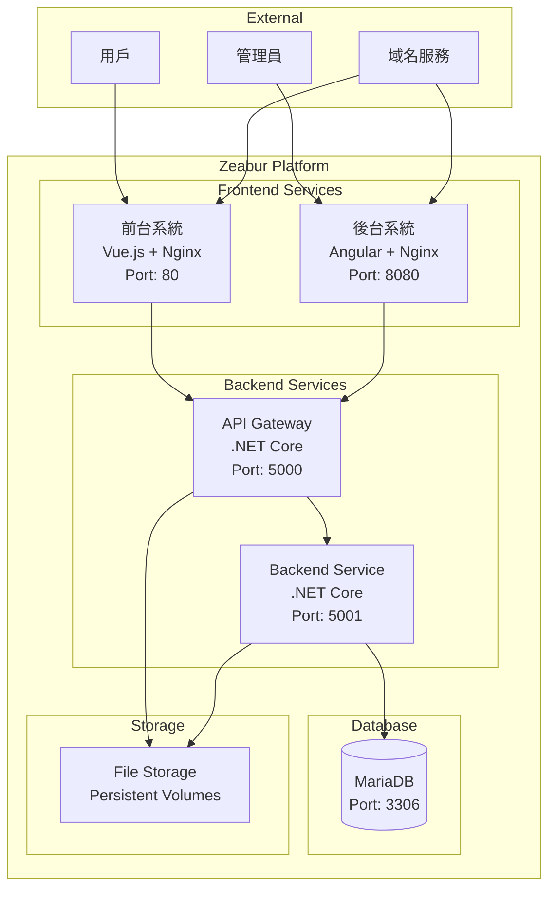

# Zeabur 部署設計文件

## 概述

本設計文件描述了如何將現有的 Docker 容器化應用程式部署到 Zeabur 雲端平台。Zeabur 是一個現代化的應用程式部署平台，支援多種程式語言和框架，提供自動化部署、擴展和監控功能。

## 架構設計

### 整體架構



### 服務配置

#### 1. MariaDB 資料庫服務

**服務類型：** Database Service
**映像：** mariadb:11.3.2
**配置：**
- 記憶體：512MB - 1GB
- 存儲：10GB SSD
- 備份：每日自動備份

**環境變數：**
```env
MYSQL_ROOT_PASSWORD=${DB_ROOT_PASSWORD}
MYSQL_DATABASE=${DB_NAME}
MYSQL_USER=${DB_USER}
MYSQL_PASSWORD=${DB_PASSWORD}
MYSQL_CHARACTER_SET_SERVER=utf8mb4
MYSQL_COLLATION_SERVER=utf8mb4_general_ci
TZ=Asia/Taipei
```

**初始化腳本：**
- `/docker-entrypoint-initdb.d/01-schema.sql`
- `/docker-entrypoint-initdb.d/02-default-data.sql`
- `/docker-entrypoint-initdb.d/03-default-user.sql`

#### 2. Backend Service (.NET Core 微服務)

**服務類型：** Web Service
**建置方式：** Dockerfile
**路徑：** `backendAPI/DotNetBackEndCleanArchitecture/Presentation/DotNetBackEndService/Dockerfile`

**配置：**
- CPU：0.5 vCPU
- 記憶體：512MB
- 端口：5001

**環境變數：**
```env
ASPNETCORE_ENVIRONMENT=Production
ASPNETCORE_URLS=http://+:5001
ConnectionStrings__BackEndDatabase=Server=${DB_HOST};Port=3306;User Id=${DB_USER};Password=${DB_PASSWORD};Database=${DB_NAME};CharSet=utf8mb4;AllowUserVariables=True;UseAffectedRows=False;
TZ=Asia/Taipei
JWT__SecretKey=${JWT_SECRET_KEY}
JWT__Issuer=${JWT_ISSUER}
JWT__Audience=${JWT_AUDIENCE}
JWT__ExpiryMinutes=${JWT_EXPIRY_MINUTES}
Serilog__MinimumLevel__Default=${LOG_LEVEL}
```

#### 3. API Gateway (.NET Core)

**服務類型：** Web Service
**建置方式：** Dockerfile
**路徑：** `backendAPI/DotNetBackEndCleanArchitecture/Dockerfile`

**配置：**
- CPU：0.5 vCPU
- 記憶體：512MB
- 端口：5000

**環境變數：**
```env
ASPNETCORE_ENVIRONMENT=Production
ASPNETCORE_URLS=http://+:5000
ConnectionStrings__BackEndDatabase=Server=${DB_HOST};Port=3306;User Id=${DB_USER};Password=${DB_PASSWORD};Database=${DB_NAME};CharSet=utf8mb4;AllowUserVariables=True;UseAffectedRows=False;
APIUrl=http://${BACKEND_SERVICE_HOST}:5001/
TZ=Asia/Taipei
JWT__SecretKey=${JWT_SECRET_KEY}
JWT__Issuer=${JWT_ISSUER}
JWT__Audience=${JWT_AUDIENCE}
JWT__ExpiryMinutes=${JWT_EXPIRY_MINUTES}
CORS__AllowedOrigins=${CORS_ALLOWED_ORIGINS}
FileUpload__MaxFileSize=${FILE_UPLOAD_MAX_SIZE}
FileUpload__AllowedExtensions=${FILE_UPLOAD_EXTENSIONS}
Hangfire__DashboardEnabled=${HANGFIRE_DASHBOARD_ENABLED}
Serilog__MinimumLevel__Default=${LOG_LEVEL}
```

#### 4. 前台系統 (Vue.js + Nginx)

**服務類型：** Static Site / Web Service
**建置方式：** Dockerfile
**路徑：** `frontend/Dockerfile`

**配置：**
- CPU：0.25 vCPU
- 記憶體：256MB
- 端口：80

**Nginx 配置調整：**
- API 代理指向 Zeabur 內部服務
- 支援 SPA 路由
- 啟用 Gzip 壓縮
- 設定適當的快取策略

#### 5. 後台管理系統 (Angular + Nginx)

**服務類型：** Static Site / Web Service
**建置方式：** Dockerfile
**路徑：** `backend/FontEnd/Dockerfile`

**配置：**
- CPU：0.25 vCPU
- 記憶體：256MB
- 端口：8080

**特殊配置：**
- 修正 Angular base href 設定
- API 代理指向 Zeabur 內部服務
- 支援 Angular 路由

## 網路和連接

### 服務間通信

在 Zeabur 中，服務間可以透過內部網路進行通信：

1. **前台 → API Gateway**
   - 透過 nginx proxy_pass 配置
   - 目標：`http://${API_GATEWAY_HOST}:5000/api/`

2. **後台 → API Gateway**
   - 透過 nginx proxy_pass 配置
   - 目標：`http://${API_GATEWAY_HOST}:5000/api/`

3. **API Gateway → Backend Service**
   - 透過 HttpClient 調用
   - 目標：`http://${BACKEND_SERVICE_HOST}:5001/`

4. **Backend Service → MariaDB**
   - 透過 Entity Framework Core
   - 連接字串：`Server=${DB_HOST};Port=3306;...`

### 域名配置

**主域名：** `your-app.zeabur.app`
- 前台系統：`https://your-app.zeabur.app`
- 後台系統：`https://admin.your-app.zeabur.app` 或 `https://your-app.zeabur.app/admin`

**自定義域名：** (可選)
- 前台：`https://yourdomain.com`
- 後台：`https://admin.yourdomain.com`

## 檔案存儲設計

### 持久化存儲

Zeabur 提供持久化存儲卷，用於存儲上傳的檔案：

```yaml
volumes:
  - name: uploads
    mount: /app/uploads
    size: 5GB
  - name: kyc-images
    mount: /app/KycImages
    size: 2GB
  - name: deposit-images
    mount: /app/DepositImages
    size: 2GB
  - name: withdraw-images
    mount: /app/WithdrawImages
    size: 2GB
  - name: ann-images
    mount: /app/AnnImagessss
    size: 2GB
```

### 檔案訪問

檔案透過 API Gateway 提供訪問：
- KYC 圖片：`/api/files/kyc/{filename}`
- 存款圖片：`/api/files/deposit/{filename}`
- 提款圖片：`/api/files/withdraw/{filename}`
- 公告圖片：`/api/files/announcement/{filename}`

## 環境變數管理

### 必要環境變數

```env
# 資料庫配置
DB_HOST=mariadb-service-host
DB_NAME=rosca_db
DB_USER=rosca_user
DB_PASSWORD=secure_password_here
DB_ROOT_PASSWORD=root_password_here

# JWT 配置
JWT_SECRET_KEY=your-super-secret-jwt-key-change-in-production
JWT_ISSUER=ROSCA-API
JWT_AUDIENCE=ROSCA-Client
JWT_EXPIRY_MINUTES=60

# CORS 配置
CORS_ALLOWED_ORIGINS=https://your-app.zeabur.app,https://admin.your-app.zeabur.app

# 檔案上傳配置
FILE_UPLOAD_MAX_SIZE=10485760
FILE_UPLOAD_EXTENSIONS=.jpg,.jpeg,.png,.gif,.pdf

# 其他配置
LOG_LEVEL=Information
HANGFIRE_DASHBOARD_ENABLED=true
ASPNETCORE_ENVIRONMENT=Production
```

### 服務發現變數

Zeabur 自動提供服務發現變數：
```env
API_GATEWAY_HOST=api-gateway-service
BACKEND_SERVICE_HOST=backend-service
DB_HOST=mariadb-service
```

## 部署策略

### 部署順序

1. **MariaDB 資料庫**
   - 首先部署資料庫服務
   - 等待資料庫初始化完成
   - 驗證連接和初始資料

2. **Backend Service**
   - 部署 .NET Core 微服務
   - 配置資料庫連接
   - 驗證 API 端點

3. **API Gateway**
   - 部署 API Gateway
   - 配置與 Backend Service 的連接
   - 驗證代理功能

4. **前端服務**
   - 部署前台和後台系統
   - 配置 API 代理
   - 驗證完整流程

### 健康檢查

每個服務都配置健康檢查端點：

**API Gateway:**
```
GET /api/HomePicture/GetAnnImages
Expected: 200 OK
```

**Backend Service:**
```
GET /health
Expected: 200 OK
```

**前端服務:**
```
GET /
Expected: 200 OK
```

## 監控和日誌

### 日誌配置

使用 Serilog 進行結構化日誌記錄：

```json
{
  "Serilog": {
    "MinimumLevel": {
      "Default": "Information",
      "Override": {
        "Microsoft.AspNetCore": "Warning"
      }
    },
    "WriteTo": [
      {
        "Name": "Console",
        "Args": {
          "outputTemplate": "[{Timestamp:HH:mm:ss} {Level:u3}] {Message:lj}{NewLine}{Exception}"
        }
      }
    ]
  }
}
```

### 監控指標

- **應用程式指標：** 回應時間、錯誤率、吞吐量
- **系統指標：** CPU 使用率、記憶體使用率、磁碟 I/O
- **資料庫指標：** 連接數、查詢時間、死鎖

## 安全考量

### 網路安全

1. **HTTPS 強制：** 所有外部流量強制使用 HTTPS
2. **內部通信：** 服務間使用內部網路通信
3. **CORS 配置：** 限制跨域請求來源

### 資料安全

1. **敏感資料加密：** 密碼、JWT 密鑰等敏感資料加密存儲
2. **資料庫安全：** 使用專用資料庫用戶，限制權限
3. **檔案上傳安全：** 限制檔案類型和大小

### 存取控制

1. **JWT 認證：** API 使用 JWT 進行身份驗證
2. **角色授權：** 基於角色的存取控制
3. **API 限流：** 防止 API 濫用

## 備份和災難恢復

### 資料庫備份

1. **自動備份：** 每日自動備份資料庫
2. **備份保留：** 保留 30 天的備份記錄
3. **備份驗證：** 定期驗證備份完整性

### 檔案備份

1. **檔案同步：** 定期同步上傳檔案到雲端存儲
2. **版本控制：** 保留檔案版本歷史
3. **災難恢復：** 建立災難恢復計劃

## 性能優化

### 前端優化

1. **靜態資源快取：** 設定長期快取策略
2. **Gzip 壓縮：** 啟用內容壓縮
3. **CDN 加速：** 使用 CDN 加速靜態資源

### 後端優化

1. **連接池：** 配置資料庫連接池
2. **快取策略：** 實施適當的快取機制
3. **非同步處理：** 使用非同步 API

### 資料庫優化

1. **索引優化：** 建立適當的資料庫索引
2. **查詢優化：** 優化慢查詢
3. **連接管理：** 合理配置連接數限制